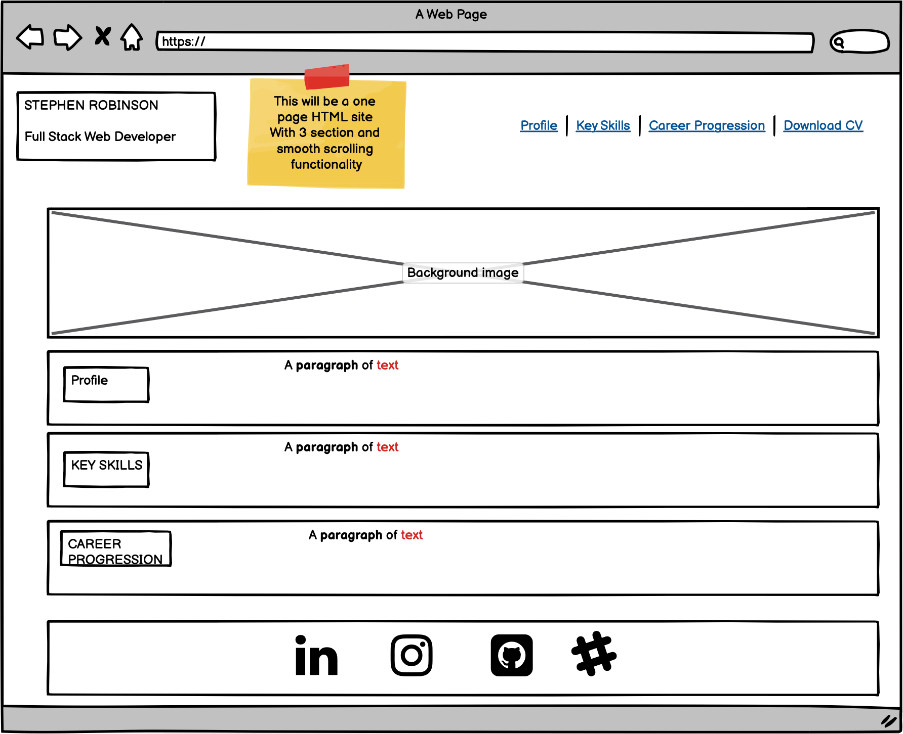

# **Stephen Robinson Portfolio CV Website**

Presentation website of Stephen Robinson portfolio, career progression and his future journey. 
On the completion of his Code Institute Full Stack Developer course where could this lead him. The possibilities would seem to be endless since 
this could lead Stephen further down the line to a multitude of various industries, but also could advance his already vast career within the TV, 
Broadcast, post production world. Some serious thought to be had there for Stephen while he progresses through his Full Stack developers course!

## **Am I Responsive**

## **UX**

Main purpose of this site is to present Stephens career progression, key skills, work experience, roles within the various companies Stephen has worked for
and where Stephen could be heading to in the future. Most importantly to achieve employment within a potential company or contract for certain projects

## **Type Of User**

- Recruiting agencies
- Possible startup companies 
- Companies that Stephen might have worked for in the past 
- Stephens LinkedIn and other social networks
- Job posting sites Indeed.co.uk, Technojobs.co.uk, Glassdoor.co.uk, Amazon.jobs etc etc...
- Stephens internal friends and family network 

## **As A User I**

- to navigate the site with ease 
- would like to see the companies Stephen has worked for in the past
- How long did Stephen work at these companies, this can show commitment 
- to see Stephens key skills 
- To be able to preview Stephens CV
- To be able to download a copy Stephens CV in pdf format
- To be able to contact Stephen through his linkedin page

## **Wireframes**

## **Existing Features**

This will be a one html page site with 3 sections and smooth scrolling fuctionality to the seperate sections. Links to social media sites, linkedin, instagram, slack. Download CV functionality for preview and for actual download of a pdf copy for possible future employees to circulate. Faviscon icon used for the title tab

## **Future Features**

- Include updates going forward of Stephens career progression
- Updates of the CV, keys skills etc...
- Improvements to mobile phone design layout
- Contact form to be added 

## **Technologies Used**

- languages used HTML and CSS
- Google Fonts used for nav bar text and paragraph text. Bebas Neue and Heebo fonts used 
- Boostrap icons used for social links and cv download down arrow
- Boostrap v5.1
- Google Chrome Dev tools for debugging

## **Testing**

Testing tools used 

- W3C Mark Up Validation https://validator.w3.org/
- Webpage Test https://www.webpagetest.org/
- Google Chrome DevTools https://developer.chrome.com/docs/devtools/
- Lighthouse https://developers.google.com/web/tools/lighthouse

## **Features working from user Experiences**  
- Smooth scrolling function works from the navbar to the 3 different sections
- Hamburger dropdown navbar working through responsive site 
- CV download preview and download copy working 
- Links to social media sites working, LinkedIn etc.. 
- Favicon icon working through title tab 

## **Deployment**

I used gitpod to create my website and used the publishing source Github. 

## **Credits**

- Great supportive site to see all HTML and CSS and to have a go aswell https://www.w3schools.com/
- Code Institute Full Stack Developer Course
- Adobe stock a great place to pick some nice looking pictures, vast amout to choose from https://stock.adobe.com/uk/
- Adobe colour wheel a great tool to extract colours and gradients from your pictures, then was able to pick some colours to use through the sites design
https://stock.adobe.com/uk/
- Used boostrap throughout the site, bootstrap icons 
https://getbootstrap.com/
- Slack a great help, searching slight issues along the way, great community https://slack.com/intl/en-gb/

## **Acknowledgements**

- Paathshala, I followed her video on youtube for the sticky navigation, with the reponsive drop down navbar https://www.youtube.com/watch?v=dfJYFzluikU
- Milestone 1 Planning with Stephen Seagrave https://www.youtube.com/watch?v=06tXTbm-DxI&list=PL_7334VduOHvzZYlgy_0kZLcic2NINCUt&index=6&t=42s
- MS1 Preperation and CSS Positioning by Suzy Bennett https://www.youtube.com/watch?v=N4bhJ4u29Do&list=PL_7334VduOHvzZYlgy_0kZLcic2NINCUt&index=23
